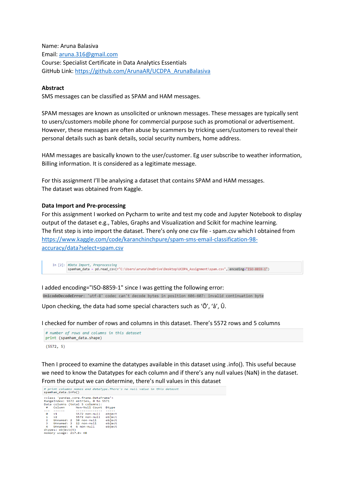

# 📩 SMS Spam vs. Ham Classification Project

This repository contains a complete Natural Language Processing (NLP) and Machine Learning project for classifying SMS messages as **SPAM** (unsolicited) or **HAM** (legitimate).  
The project covers data preprocessing, exploratory analysis, feature extraction, and model building using Multinomial Naive Bayes.

---

## 📄 Project Report

[](Aruna_UCDPA_Report.pdf)  
*Click the image above to read the full PDF report.*

---

## 📂 Repository Structure


---

## 📊 Project Overview

- **Dataset**: `spam.csv` (public SMS dataset from Kaggle)
- **Goal**: Build a machine learning model to classify SMS messages as SPAM or HAM
- **Process**:
  1. **Data Cleaning**: Removing null columns, renaming columns, encoding text
  2. **Text Preprocessing**:
     - Tokenization
     - Lowercasing
     - Removing punctuation and stopwords (NLTK)
     - Removing custom slang/abbreviations
  3. **Feature Engineering**:
     - Message length
     - Word count
     - TF-IDF vectorization
  4. **Visualization**:
     - Message length distribution
     - Word frequency (WordCloud)
     - Scatter plots comparing SPAM vs. HAM
  5. **Model Building**:
     - Multinomial Naive Bayes
  6. **Model Evaluation**:
     - Accuracy: **97%**
     - Precision: **0.99**
     - Confusion Matrix

---

## 🔍 Key Insights

- SPAM messages tend to be shorter and contain fewer words than HAM messages.
- Common SPAM terms include promotional and commercial keywords.
- The TF-IDF + Multinomial Naive Bayes approach performed strongly with minimal misclassification.

---

## 🛠 Tools & Libraries

| Library / Tool       | Purpose                          |
|----------------------|----------------------------------|
| Python 3.x           | Programming language             |
| Pandas, NumPy        | Data manipulation and analysis   |
| Matplotlib, Seaborn  | Data visualization               |
| Plotly               | Interactive visualizations       |
| NLTK                 | Text preprocessing               |
| Scikit-learn         | Machine learning & evaluation    |
| Jupyter Notebook     | Analysis & documentation         |

---

## 🚀 How to Run

1. Clone the repository:
   ```bash
   git clone https://github.com/ArunaAR/UCDPA_ArunaBalasiva.git
   cd UCDPA_ArunaBalasiva
